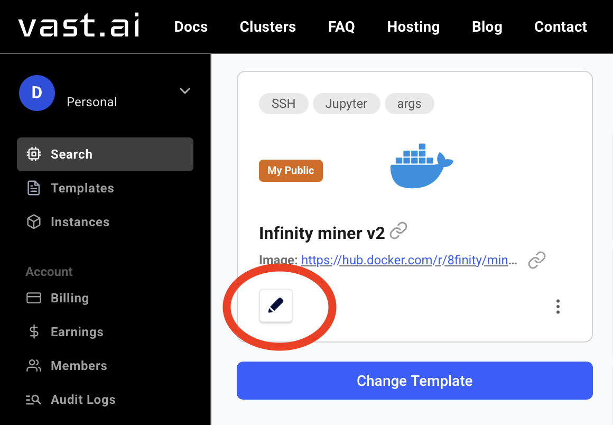
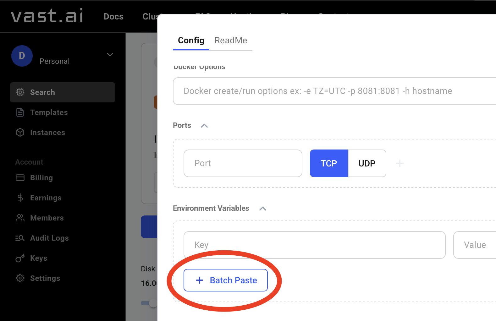
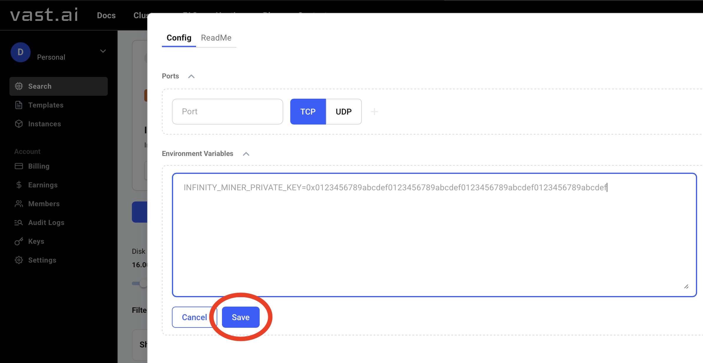

# Mining via [VAST.AI](https://cloud.vast.ai/?ref_id=239671&creator_id=239671&name=Infinity%20miner%20v2)

1. Visit [vast.ai](https://cloud.vast.ai/?ref_id=239671&creator_id=239671&name=Infinity%20miner%20v2) and create an account (or sign in). 
2. Open the Infinity [miner template](https://cloud.vast.ai/?ref_id=239671&creator_id=239671&name=Infinity%20miner%20v2).
3. Edit environment variables (click ✏️ icon).

4. Scroll down to Environment Variables, then click "Batch Paste".

5. Paste your configuration. **🚨 Remember, you should have enough $S balance to start mining! 🚨**
```
# Required: Your private key for mining (64 characters after 0x). You need to have some Sonic (S) balance to start mining.
INFINITY_MINER_PRIVATE_KEY=your_private_key_here

# Optional: RPC and WebSocket endpoints
# INFINITY_RPC=https://rpc.soniclabs.com
# INFINITY_WS=wss://rpc.soniclabs.com

# Optional: Mining rewards recipient
# INFINITY_REWARDS_RECIPIENT_ADDRESS=your_address_here

# Optional: Logging level
# LOGLEVEL=DEBUG
```
6. Click "Save" at the bottom of the page.


7. Scroll down, **🚨 change template mode to "Private" 🚨** and click "Create & Use". 


8. Choose a GPU setup in the marketplace and then click "Rent" on the machine you prefer. The more expensive it is, the more powerful it usually is.


9. ✅ Congratulations! Once your instance is up, the INFINITY miner will start automatically using the values you provided. Happy mining!
